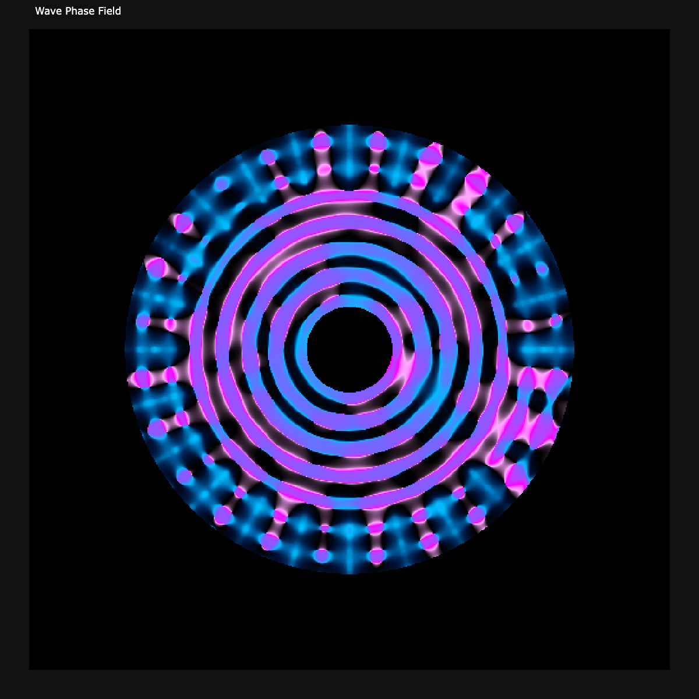
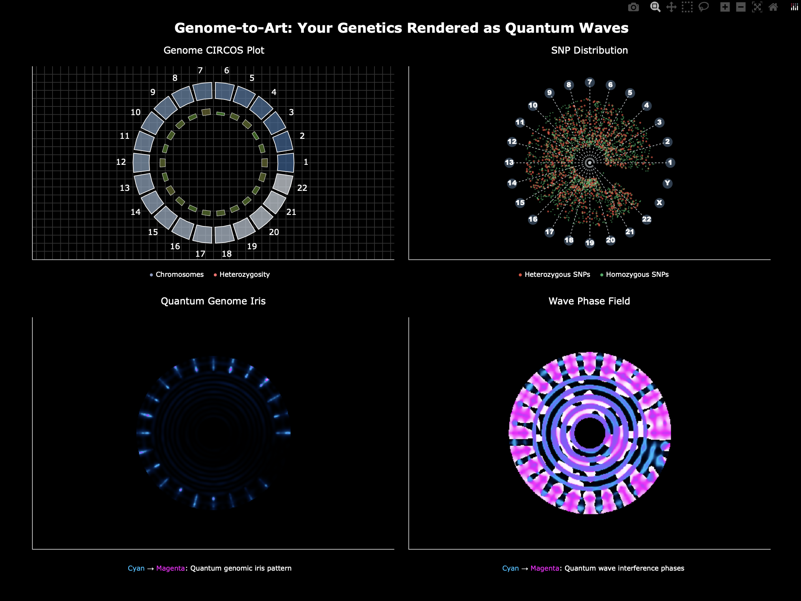
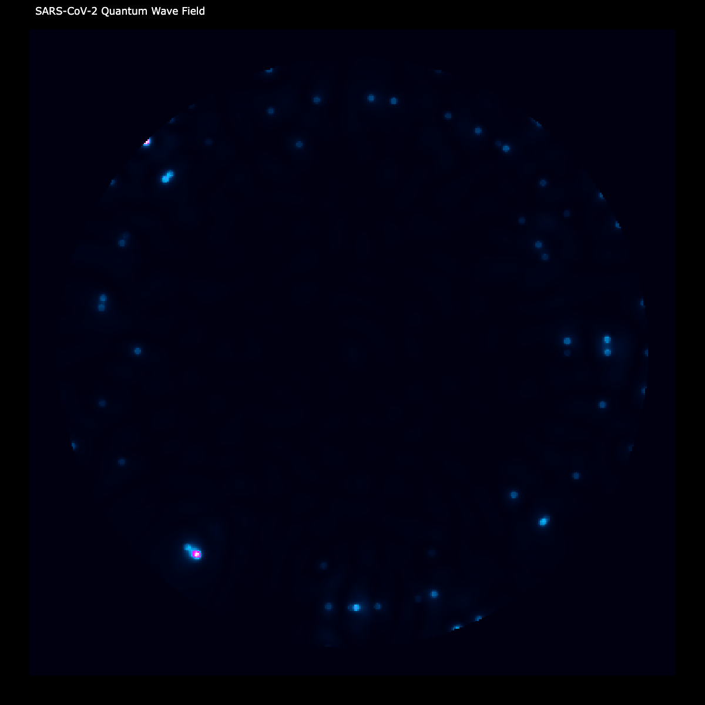

<p align="center">
  
</p>

<p align="center">
  <em>Transform your genome into quantum wave art. An experimental design for a new visual interaction with the most complex data on the planet, our DNA.</em>
</p>

<p align="center">
  <a href="#installation"></a>
  <a href="LICENSE"></a>
  <a href="#contributing"></a>
  <a href="https://github.com/anthropics/claude-code"></a>
</p>

<p align="center">
  <a href="#the-art">The Art</a> •
  <a href="#how-it-works">How It Works</a> •
  <a href="#installation">Installation</a> •
  <a href="#usage">Usage</a> •
  <a href="#the-science">The Science</a> •
  <a href="#contributing">Contributing</a>
</p>

---

<p align="center">
  
</p>

<h3 align="center">^ Your DNA, rendered as quantum wave interference patterns ^</h3>

---

## What is This?

**genome-2-art** transforms raw genetic data into mesmerizing visualizations using quantum wave interference principles. Feed it your DNA data from services like AncestryDNA or 23andMe, and watch as billions of years of evolutionary history become art.

The centerpiece? A **Quantum Genome Iris** — your DNA literally becomes the pattern of an eye looking back at you.

> _"Just as your actual iris is genetically unique and can identify you, your Quantum Genome Iris creates a pattern that could only be generated by YOUR specific DNA."_

---

## The Art

### Human Genome: Complex, Intricate, Uniquely You

<p align="center">
  
</p>

The human genome generates rich, complex patterns across four distinct visualization modes:

| Visualization           | What It Shows                                                                            |
| ----------------------- | ---------------------------------------------------------------------------------------- |
| **CIRCOS Plot**         | Chromosome boundaries with heterozygosity rates — the architecture of your genome        |
| **SNP Distribution**    | Individual genetic variants scattered like stars, red for diversity, green for stability |
| **Quantum Genome Iris** | Wave interference patterns forming iris-like structures — your genetic eye print         |
| **Wave Phase Field**    | Pure quantum wave phases from -π to +π — the mathematical soul of your DNA               |

### Viral Genome: Minimal, Ethereal, Hauntingly Simple

<p align="center">
  
</p>

<p align="center"><em>SARS-CoV-2 coronavirus genome — a sparse constellation compared to human complexity</em></p>

The contrast is striking. Where a human genome creates dense, intricate iris patterns with ~3 billion base pairs across 23 chromosome pairs, a viral genome like SARS-CoV-2 (~30,000 base pairs, single strand) produces subtle, scattered points of light — a visual testament to the vast difference in biological complexity.

---

## How It Works

```
┌─────────────────┐     ┌──────────────────┐     ┌─────────────────┐
│   Your Genome   │ ──▶ │  Quantum Wave    │ ──▶ │   Unique Art    │
│   (DNA Data)    │     │   Transformation │     │   (Your Iris)   │
└─────────────────┘     └──────────────────┘     └─────────────────┘
```

**1. Load** → Your raw genetic data (AncestryDNA format)

**2. Transform** → Each nucleotide becomes a wave with specific properties:

- **A** (Adenine): Low frequency, high amplitude — stable, fundamental waves
- **T** (Thymine): Medium frequency, medium amplitude — transitional waves
- **C** (Cytosine): High frequency, low amplitude — rapid oscillations
- **G** (Guanine): Very high frequency, very low amplitude — fine detail

**3. Interfere** → Homozygous variants create pure tones; heterozygous variants create complex beat frequencies and interference patterns

**4. Render** → Wave patterns mapped to polar coordinates, creating iris-like structures

---

## Installation

### Prerequisites

- Python 3.8 or higher
- Your raw DNA data file (AncestryDNA `.txt` format)

### Quick Start

```bash
# Clone the repository
git clone https://github.com/RazatDesignLab/genome-2-art.git
cd genome-2-art

# Create virtual environment (recommended)
python -m venv .venv
source .venv/bin/activate  # On Windows: .venv\Scripts\activate

# Install dependencies
pip install -r requirements.txt
```

### Dependencies

```
pandas>=1.3.0
numpy>=1.21.0
plotly>=5.0.0
kaleido>=0.2.1
matplotlib
seaborn
```

---

## Usage

### Human Genome Art

Place your AncestryDNA raw data file as `AncestryDNA.txt` in the project directory, then:

```bash
python genome-2-art_v2.py
```

### Viral Genome Art

For viral genomes (VCF format):

```bash
python viral-genome-2-art.py
```

### Output

The script generates:

- **Interactive HTML** — Full visualization suite with hover details
- **High-resolution PNG** — 1200×1200 pixel images
- **Vector SVG** — Resolution-independent, infinitely scalable for print or display at any size

---

## The Science

### Quantum Wave Mapping

SNPs (Single Nucleotide Polymorphisms) are converted to wave properties:

| Nucleotide | Frequency | Amplitude | Character           |
| ---------- | --------- | --------- | ------------------- |
| A          | 1.0       | 1.0       | Stable, fundamental |
| T          | 2.0       | 0.8       | Transitional        |
| C          | 3.0       | 0.6       | Rapid oscillation   |
| G          | 4.0       | 0.4       | Fine detail         |

### Genotype Interference

- **Homozygous** (AA, TT, CC, GG): Pure wave tones, no phase interference
- **Heterozygous** (AT, AC, AG...): Complex beat frequencies, phase shifts calculated as `|freq₁ - freq₂| × π/4`

### Iris Anatomy Mapping

| Radius Zone     | Iris Feature | Genetic Mapping            |
| --------------- | ------------ | -------------------------- |
| R < 2.0         | Pupil        | Genetic void/core          |
| R ≈ 4.0         | Collarette   | Wave interference boundary |
| R ≈ 10          | Limbal ring  | Outer edge boundary        |
| Radial patterns | Iris fibers  | SNPs by chromosome sector  |

### Technical Specs

- **Resolution**: 600×600 coordinate matrix
- **SNP Sampling**: Up to 3,000 SNPs across all chromosomes
- **Wave Physics**: Multi-layer primary, harmonic, and radial components
- **Color Scheme**: Scientific cyan-magenta gradient (research standard)

---

## Data Sources

### For Testing (Included)

The `public_genomes/` folder contains freely available SARS-CoV-2 viral genome data for testing the visualization pipeline.

### For Your Personal Art

Use raw data from:

- **AncestryDNA** — Export your raw DNA data from account settings
- **23andMe** — Download raw data (may require format conversion)
- **Other services** — Any service providing raw genotype data in compatible format

### Data Format

The script expects tab-delimited genetic data in AncestryDNA format. See [`AncestryDNA_mock.txt`](AncestryDNA_mock.txt) for a sample file.

| rsid | chromosome | position | allele1 | allele2 |
|------|------------|----------|---------|---------|
| rs3131972 | 1 | 752721 | A | A |
| rs4040617 | 1 | 779322 | A | G |
| rs11240777 | 1 | 798959 | A | G |
| rs6657440 | 1 | 850780 | T | C |
| rs4970461 | 1 | 852964 | T | G |

- **rsid** — SNP identifier (reference SNP ID)
- **chromosome** — Chromosome number (1-22, X, Y, MT)
- **position** — Base pair position (human reference build 37.1)
- **allele1/allele2** — The two nucleotides at this position (your genotype)

Homozygous genotypes (AA, TT, CC, GG) produce pure wave tones. Heterozygous genotypes (AG, TC, etc.) create interference patterns.

---

## Privacy & Security

**Your genetic data never leaves your computer.**

- All processing happens locally
- No data is transmitted to external servers
- No cloud storage or third-party services
- Your DNA, your art, your privacy

---

## Example Gallery

|                 Human Genome Iris                  |                Viral Constellation                 |
| :------------------------------------------------: | :------------------------------------------------: |
|  |  |
| _Complex, intricate patterns from ~3B base pairs_  |   _Sparse, ethereal points from ~30K base pairs_   |

---

## Contributing

Contributions are welcome! Whether you're fixing bugs, adding features, or improving documentation, we'd love your help.

### Ways to Contribute

- **Report bugs** — Open an issue with details about the problem
- **Suggest features** — Share ideas for new visualizations or data formats
- **Submit PRs** — Fork, branch, code, and submit a pull request
- **Share your art** — Created something beautiful? We'd love to see it!

### Development Setup

```bash
git clone https://github.com/RazatDesignLab/genome-2-art.git
cd genome-2-art
python -m venv .venv
source .venv/bin/activate
pip install -r requirements.txt
```

---

## Roadmap

- [ ] Support for 23andMe raw data format
- [ ] Additional visualization modes (spiral, helix, constellation)
- [ ] Interactive web interface
- [ ] Comparative visualization (overlay multiple genomes)
- [ ] Animation support (watch your genome "grow")
- [ ] Custom color schemes

---

## Acknowledgments

Starting with human creativity and curiosity, this project was a collaborative exercise in ideation and development with **Anthropic Claude AI**:

- **Claude 3 Opus** — Quantum wave interference concepts and mathematical foundations
- **Claude 3.5 Sonnet** — Artistic iris visualization algorithms and code optimization
- **Claude Opus 4.5** — Documentation and code review

The breakthrough insight — transforming genomic wave patterns into iris-like structures — emerged from this human-AI collaboration.

---

## License

This project is licensed under the MIT License — see the [LICENSE](LICENSE) file for details.

---

## Citation

If you use genome-2-art in research or creative works, please cite:

```bibtex
@software{genome2art,
  title = {genome-2-art: Quantum Wave Visualization of Genetic Data},
  author = {Kaza Razat for Razat Design Lab},
  year = {2026},
  url = {https://github.com/RazatDesignLab/genome-2-art}
}
```

---

<p align="center">
  
</p>

<p align="center">
  <strong>Your DNA is art. Let it be seen.</strong>
</p>

<p align="center">
  Made with science, rendered with beauty
</p>
